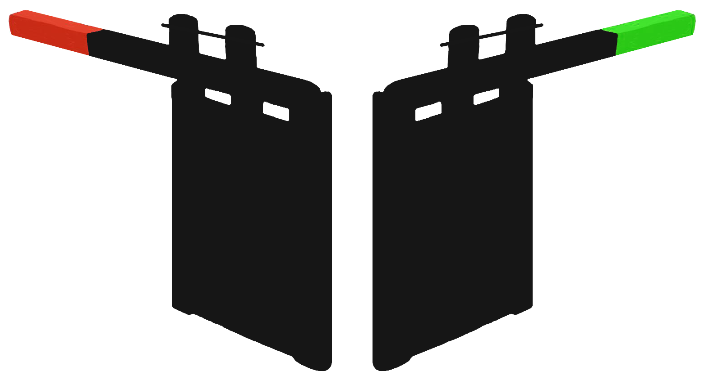

# Lockkeeper




Lockkeeper is an open source ( GPL v3.0 License )[License.md] application intended to provide Escape Room creators and easy to use off the shelf tool for developing, controlling and deploying their projects.

Welcome ERIC 2019 Workshop participants. The Flow for the workshop control panel is availble here https://raw.githubusercontent.com/paulhayes/escape-room-template-node-red-project/eric2019workshop/flow.json

Source code for the Control Panel's Microcontrollers are available as [Platformio](https://platformio.org/) projects: https://github.com/paulhayes/eric2019-workshop

It's features include 
* Dashboard
* Timer
* Logging
* Force unlocks
* Communication checking

## To Use

Alpha releases will be available soon. Alternatively you can clone and build the project yourself.

To clone and run this repository you'll need [Git](https://git-scm.com) and [Node.js](https://nodejs.org/en/download/) (which comes with [npm](http://npmjs.com)) installed on your computer. From your command line:

```bash
# Clone this repository
git clone https://github.com/dceejay/electron-node-red.git
# Go into the repository
cd electron-node-red
# Install dependencies and run the app
npm install && npm run clean && npm start
```

## TL:DR - building runtimes

On OSX you can run `./buildall` to build binaries of "everything"... maybe...

Run `npm run pack` to create packages for all platforms - these are the files required to run, they are not binary installers.

Builds are created in the `build` directory. Runtimes are created in the `../electron-bin` directory.

**Note**: this was written to work on a Mac... other tools may/will be needed on other platforms.

## Packaging your application

If you want to distribute executables of this project, the easiest way is to use electron-builder:

```
npm run dist
```

## License [GPLv3](LICENSE.md)

## See also
 - **Stand-alone Starter Project** - https://github.com/dceejay/node-red-project-starter
 - **Bluemix Starter Project** - https://github.com/dceejay/node-red-bluemix-starter
